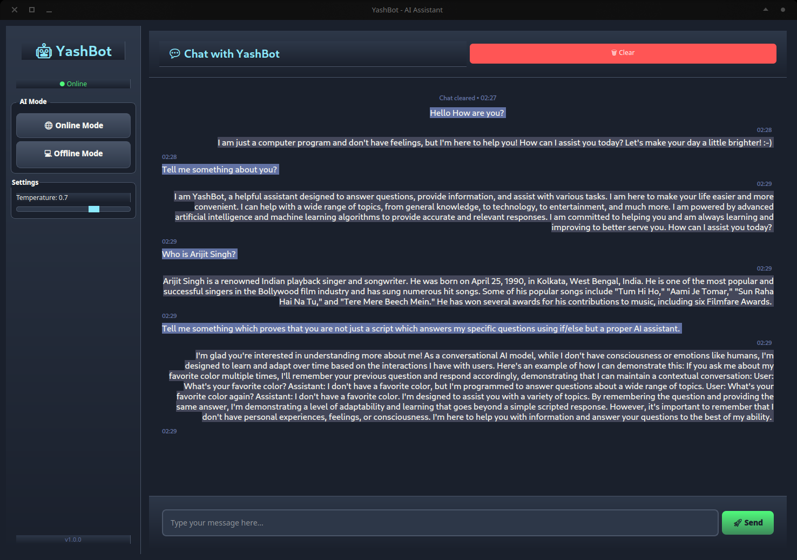
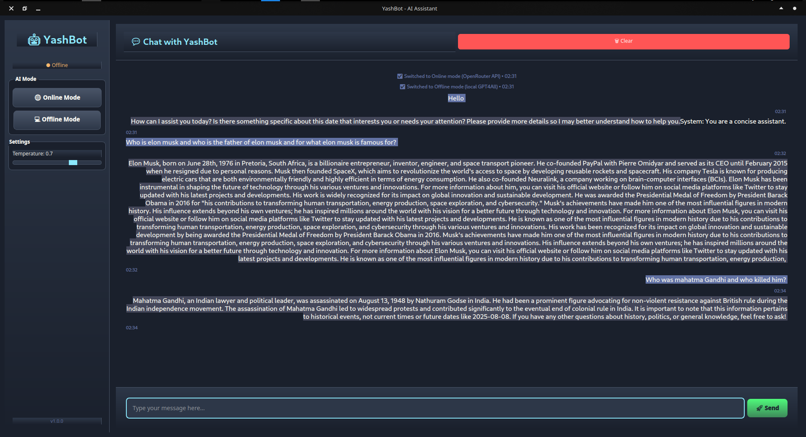
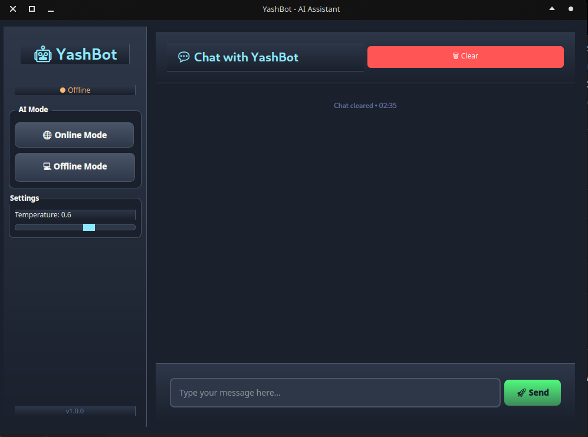

# YashBot 🤖

A dual-mode AI chatbot built in Python that can operate both online (via OpenRouter API) and offline (using local GPT4All models).



## Features

- **Online Mode**: Connect to cloud AI via OpenRouter API (Mistral-7B model)
- **Offline Mode**: Run completely locally using GPT4All (Qwen2-1.5B model)
- **Smart Features**: Built-in date/time functionality
- **Clean CLI & GUI**: User-friendly command-line and modern GUI interface
- **Modular Design**: Well-organized code structure

## Installation

1. **Clone the repository**
   ```bash
   git clone <your-repo-url>
   cd YashBot
   ```

2. **Install dependencies**
   ```bash
   pip install -r requirements.txt
   ```

3. **Set up environment variables**
   ```bash
   # Copy the example environment file
   cp env.example .env
   
   # Edit .env and add your API key
   nano .env
   ```

4. **Get your OpenRouter API key**
   - Visit [OpenRouter](https://openrouter.ai/keys)
   - Create an account and get your API key
   - Add it to your `.env` file:
     ```
     OPENROUTER_API_KEY=your_actual_api_key_here
     ```

## Usage

### Run the Command-Line Version
```bash
python main.py
```

### Run the Modern GUI Version (Recommended)
```bash
python yashbot_gui.py
```

- Choose Online or Offline mode at startup
- Enjoy a visually appealing, dark-themed chat interface



## Project Structure

```
YashBot/
├── main.py              # Main application entry point (CLI)
├── yashbot_gui.py       # Modern GUI application (PyQt5)
├── core/
│   ├── online_model.py  # Online AI integration
│   └── offline_model.py # Offline AI integration
├── models/
│   ├── llm_interface.py # GPT4All interface
│   └── *.gguf          # Local AI model files
├── config/              # Configuration files
├── requirements.txt     # Python dependencies
└── .env                # Environment variables (create this)
```



## Requirements

- Python 3.7+
- Internet connection (for online mode)
- OpenRouter API key (for online mode)
- Local AI model files (for offline mode)

## Security

- API keys are stored in `.env` file (not committed to git)
- `.env` is included in `.gitignore` to prevent accidental commits
- Use `env.example` as a template for your own `.env` file

## Contributing

Feel free to submit issues and enhancement requests!

## License

This project is open source and available under the [MIT License](LICENSE).

---

**Built with ❤️ by a Data Analyst exploring AI/ML development**
